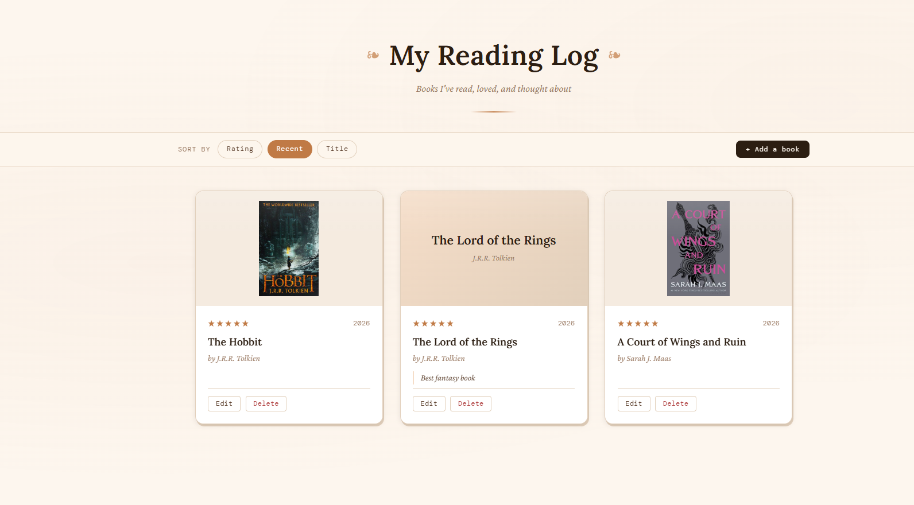
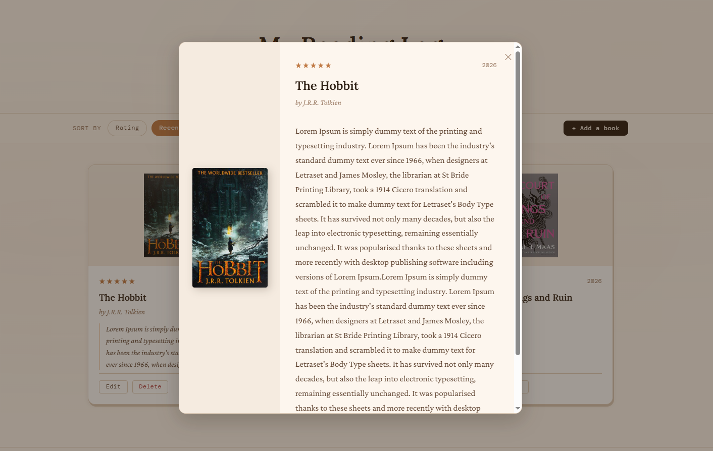
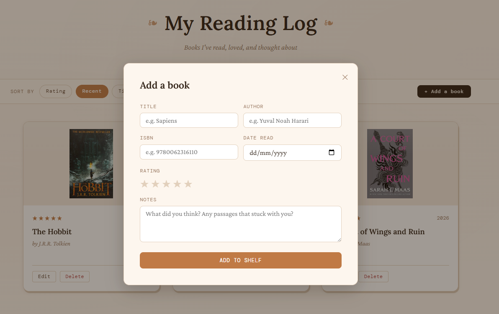

# 📚 My Reading Log

🔗 **Live Demo:** https://book-notes-rv2z.onrender.com/

A full-stack reading journal built with **Node.js**, **Express**, **PostgreSQL**, and **EJS**.
Users can keep track of books they have read, rate them, write personal notes, and organise their collection through a clean, book-inspired interface.

## Features

* Add books to your reading log
* Edit existing entries
* Delete books from your collection
* Rate books from 1–5 stars
* Store personal reading notes
* Sort books by:

  * Rating
  * Date Read
  * Title
* Automatic book search and autofill using the Open Library API
* Automatic book cover retrieval from ISBN numbers
* Custom fallback covers when no cover image is available
* Responsive layout for desktop and mobile devices
* Detailed book view modal

## Built With

* Node.js
* Express.js
* PostgreSQL
* EJS
* HTML5
* CSS3
* JavaScript
* Open Library API

## Installation

1. Clone the repository

```bash
git clone https://github.com/YOUR_USERNAME/book-notes.git
```

2. Navigate into the project folder

```bash
cd book-notes
```

3. Install dependencies

```bash
npm install
```

4. Create a PostgreSQL database and table

```sql
CREATE TABLE book_notes_books (
  id SERIAL PRIMARY KEY,
  title TEXT NOT NULL,
  author TEXT NOT NULL,
  isbn TEXT,
  cover_url TEXT,
  rating INTEGER,
  date_read DATE,
  notes TEXT
);
```

5. Configure your database connection.

6. Start the application

```bash
npm start
```

7. Open in your browser

```text
http://localhost:3000
```

## Screenshots

### Home Page



### Book Details



### Add Book Modal



## What I Learned

This project helped me practice:

* Building a full CRUD application
* Working with PostgreSQL databases
* Using Express routes and middleware
* Server-side rendering with EJS
* Integrating third-party APIs
* Handling missing API data gracefully
* Creating responsive layouts with CSS
* Deploying full-stack applications

## Future Improvements

* Search and filter functionality
* Reading statistics dashboard
* Book categories and tags
* User authentication
* Reading goals and progress tracking

## License

This project is for educational and portfolio purposes.
