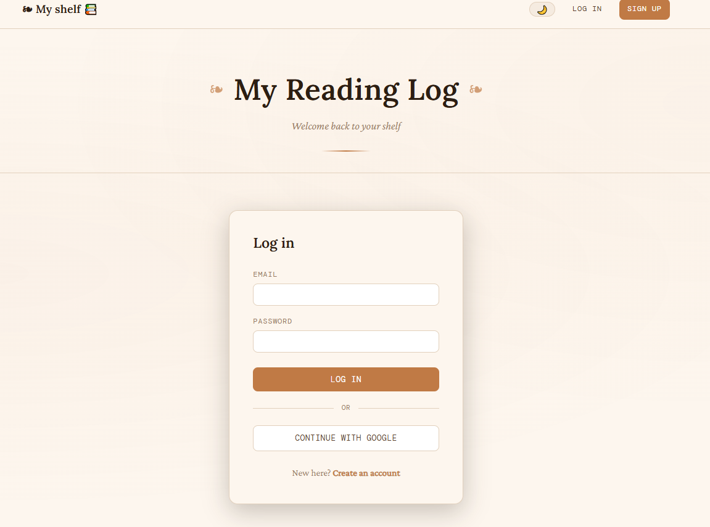
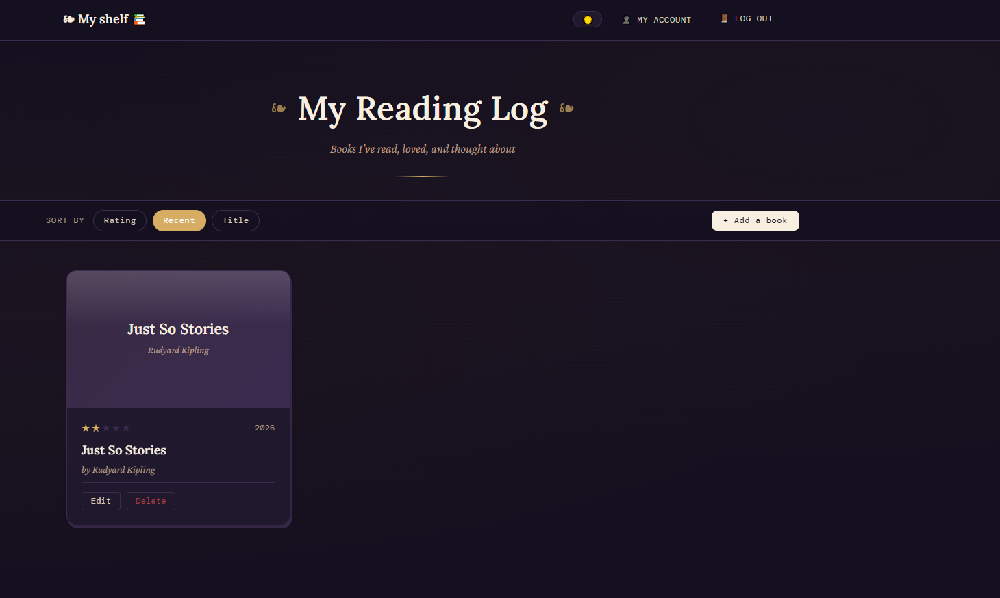
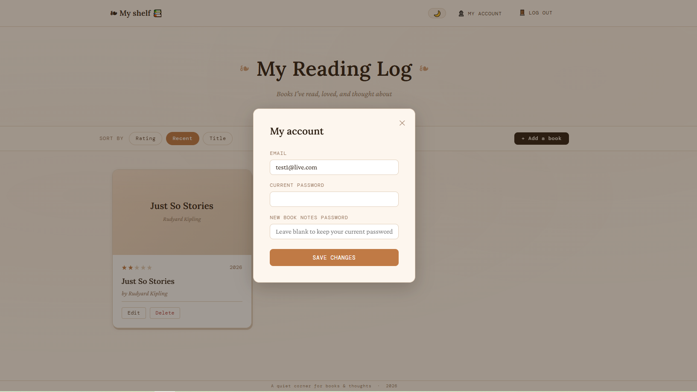

# 📚 My Reading Log

🔗 **Live Demo:** https://book-notes-rv2z.onrender.com/

A full-stack reading journal built with **Node.js**, **Express**, **PostgreSQL**, and **EJS**.
Users can keep track of books they have read, rate them, write personal notes, and organise their collection through a clean, book-inspired interface.

## Features

- Add books to your reading log
- Edit existing entries
- Delete books from your collection
- Rate books from 1–5 stars
- Store personal reading notes
- Sort books by:
  - Rating
  - Date Read
  - Title

- Automatic book search and autofill using the Open Library API
- Automatic book cover retrieval from ISBN numbers
- Custom fallback covers when no cover image is available
- Responsive layout for desktop and mobile devices
- Detailed book view modal
- User registration and login
- Google OAuth login
- Each user has their own private book collection
- Account settings modal
- Light and dark mode toggle

## Built With

- Node.js
- Express.js
- PostgreSQL
- EJS
- HTML5
- CSS3
- JavaScript
- Open Library API
- Passport.js
- bcrypt
- express-session
- Supabase PostgreSQL
- Google OAuth

## Environment Variables

Create a `.env` file in the project root and add:

```env
DATABASE_URL=your_supabase_database_url
SESSION_SECRET=your_session_secret
BASE_URL=http://localhost:3000
GOOGLE_CLIENT_ID=your_google_client_id
GOOGLE_CLIENT_SECRET=your_google_client_secret
```

## Installation

1. Clone the repository

```bash
git clone https://github.com/ValeriaBrizzolari/book-notes.git
```

2. Navigate into the project folder

```bash
cd book-notes
```

3. Install dependencies

```bash
npm install
```

4. Create a PostgreSQL database and table

```sql
CREATE TABLE users (
  id SERIAL PRIMARY KEY,
  email TEXT UNIQUE NOT NULL,
  password TEXT,
  created_at TIMESTAMP DEFAULT CURRENT_TIMESTAMP
);

CREATE TABLE books (
  id SERIAL PRIMARY KEY,
  user_id INTEGER NOT NULL REFERENCES users(id) ON DELETE CASCADE,
  title TEXT NOT NULL,
  author TEXT,
  isbn TEXT,
  cover_url TEXT,
  rating INTEGER,
  date_read DATE,
  notes TEXT
);
```

5. Configure your database connection.

6. Start the application

```bash
npm start
```

7. Open in your browser

```text
http://localhost:3000
```

## Screenshots

### Home Page


### Book Details


### Add Book Modal


### Login Page



### Dark Mode



### Account Settings



## What I Learned

This project helped me practice:

- Building a full CRUD application
- Working with PostgreSQL databases
- Using Express routes and middleware
- Server-side rendering with EJS
- Integrating third-party APIs
- Handling missing API data gracefully
- Creating responsive layouts with CSS
- Deploying full-stack applications

## Future Improvements

- Search and filter functionality
- Reading statistics dashboard
- Book categories and tags
- Reading goals and progress tracking

## License

This project is for educational and portfolio purposes.
